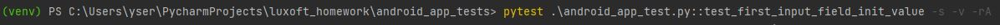
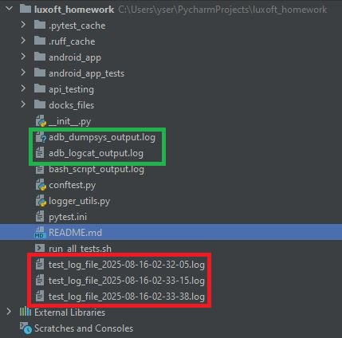

# Sebastian Stach - Senior Automation QA Assessment

## 1. Project Tree
Project tree contains three major components:
- android_app catalog - contains Android Application
- android_app_tests catalog - contains automated tests covering Android Application
- api_testing catalog - contains automated tests covering HTTP Flask server

## 2. Android Application test environment preparation
To run Android Application it's necessary to start emulator.
It can be achieved via Android Studio SW.
(*For this point I have used AI to find information about ADS setup)

Another needed tool is Python library called: UIAutomator2.
This package allows to control and read all elements of emulated Android application directly from Python script.

Last think about preparation is to find resource ids of all elements in Android Application.
It that case following method from UIAutomator can be used: ".dump_hierarchy()"

Based on that following application controllers has been found:

Last two points to operate with application is to install and start the application.
All actions needed to set-up environment (except ADS/Emulator) are automatically covered by test automation.

It is necessary to fulfill data in "utils.py" file contains: app name, app path and emulator name:

## 3. How to run Android Application automated tests - pytest
All automated tests (except Gherkin BDD) are based on Pytest framework. 
So it's necessary to install "Pytest" library first.

All automated tests are set in "android_app_test.py" file.

Available tests:
- test_get_app_info_and_hierarchy
- test_first_input_field_init_value
- test_second_input_field_init_value
- test_first_input_field_valid_value
- test_second_input_field_valid_value
- test_first_input_field_invalid_value
- test_second_input_field_invalid_value
- test_init_value_of_res_field
- test_add_button
- test_sub_button
- test_div_button
- test_mul_button

Remember to activate VENV if needed.

First go to "android_app_tests" catalog and then run following command:

Expected output from tests should look like:

It's possible to run one selected tests. In this case just use test name and run command similar to:

Expected output from one test should look like:

After every test run there is a log file created in the same place where test script is stored.
Each log file has individual date and time in file name.

## 3. How to run Android Application Gherkin BDD test

To run Gherkin BDD test it's necessary to install "behave" library.

Gherkin BDD test is set in "/features" and "/features/steps" catalogs.
File "gherkin_test.feature" contains natural language test description.
File "gherkin_test.py" contains python test using "behave" library.

To run this BDD test it's necessary to go to "android_app_tests" and run following command:

Expected output of the test:

## 4. How to run HTTP Flask server automated tests - pytest

To run HTTP Flask server tests it's necessary to install "flask" library.

Not any special preparation or data fulfillment is required.

All automated tests are set in "api_calls_test.py" file.

Available tests:
- test_get_users
- test_get_user_valid_id
- test_get_user_invalid_id
- test_add_user_valid_data
- test_add_user_invalid_data

Remember to activate VENV if needed.

First go to "api_testing" catalog and then run following command:

Expected output from tests should look like:

It's possible to run one selected tests. In this case just use test name and run command similar to:

Expected output from one test should look like:

After every test run there is a log file created in the same place where test script is stored.
Each log file has individual date and time in file name.

## 5. How to run all tests in the project using bash script

Main catalog of the project contains also bash script called "run_all_tests.sh" that is able to run all prepared tests:
- android app automated tests
- android app BDD test
- api http server tests

Additionally, this script copies all found log files from internal catalogs and pastes it in the same place where bash script is stored.

It stores also in separate files data from following commands:
- adb logcat
- adb shell dumpsys

To run this script it's necessary to open some tool that is able to operate with bash scripts.

In this example "Git Bash" is used. Remember to activate VENV if needed.

To run script go to main catalog and call following command:

Example output (stdout) of "run_all_tests.sh" bash script can be found in "bash_script_output.log" file that is placed also in main project catalg.

When script finish his work, all log files are available in main catalog:

## 6. Project requirements

Python related: 
- Python >= 3.10
- UIAutomator2
- Flask
- requests
- behave
- pytest

External tools:
- Android Studio
